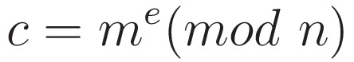
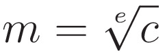

# miniRSA
points: 300

## Table of Contents
  * [Description](#description)
  * [Hints](#hints)
  * [Solution](#solution)
    * [**Tools**](#tools)
  * [Flag](#flag)

## Description
Let's decrypt this: [ciphertext](files/ciphertext)? Something seems a bit small.

## Hints
1. <details> 
    <summary>Hint 1</summary> 

    RSA <a href="https://en.wikipedia.org/wiki/RSA_(cryptosystem)">tutorial</a> 
   
   </details>

2. <details>
    <summary>Hint 2</summary>
    
    How could having too small an e affect the security of this 2048 bit key?
    
    </details>

3. <details>
    <summary>Hint 3</summary>
    
    Make sure you don't lose precision, the numbers are pretty big (besides the e value)
    
    </details>

## Solution

### **Tools**
I used Python to complete this challenge. Particularly, I used the following libraries:
1. [decimal](https://docs.python.org/3/library/decimal.html): 
   * to avoid losing precision since we will be dealing with large numbers
2. [re](https://docs.python.org/3/library/re.html): 
   * to obtain the values, such as ```e```, ```n``` and the ciphertext ```c```
  
```python
import decimal
import re

# set the precision to a relatively large number
# otherwise, the flag might not be decoded correctly
decimal.getcontext().prec = 100
```

Next, we can read the file and obtain the values for ```n```, ```e``` and the ciphertext ```c```.

```python
opened_file = open("miniRSA")

content = opened_file.read()

# n contains 1 or more digits, therefore, [0-9]+
n = decimal.Decimal(re.search(r'N: ([0-9]+)', content).group(1))
# in this case, e only contains 1 digit, thus, [0-9]
e = decimal.Decimal(re.search(r'e: ([0-9])', content).group(1))
# c contains 1 or more digits, so we use the same regex as n
c = decimal.Decimal(re.search(r'\(c\): ([0-9]+)', content).group(1))
```

The challenge description refers to the value of ```e```, which is a really small number, and this can affect the security of the RSA algorithm.

Usually, breaking RSA encryption is infeasible as it requires us to break ```n``` into ```p``` and ```q```, i.e. ```n = p * q```, to obtain the decryption key ```d```. The security of RSA comes from this factorisation problem, which is known to be practically difficult.

In this case, however, we can assume that the message ```m``` will be relatively short as it contains the flag. Since ```e``` is a very small number, ```m``` to the power of ```e``` will not likely be greater than ```n```. Thus, the ```mod n``` part of the equation will not be invoked.



We can now compute the ciphertext ```c``` as follows:


Therefore, to obtain the message ```m```, we can use the following equation:



Which can be implemeted easily in Python.

```python
# round the result, otherwise, it won't return the correct type
m = round(c ** (1/e))
```

Finally, we can get the flag by converting the message into hex and decode it into a string.

```python
# convert the message to hex with hex(m)
# remove the prefix 0x with hex(m)[2:]
# create a bytearray so that it can be decoded back to string
flag = bytearray.fromhex(hex(m)[2:]).decode()

print(flag)
```

Completed script: [miniRSA.py](files/miniRSA.py)

## Flag
<details>
    <summary>Flag</summary>
        picoCTF{n33d_a_lArg3r_e_606ce004}
</details>