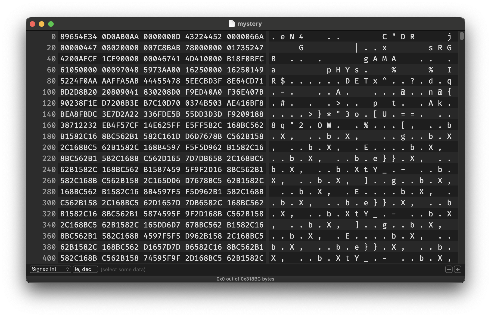
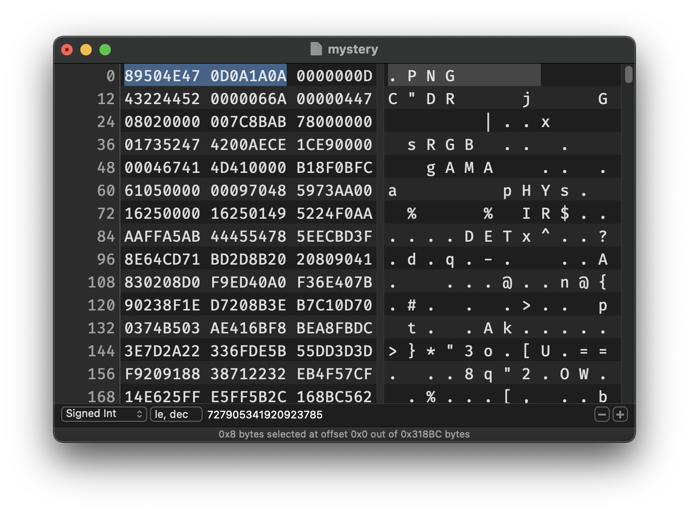
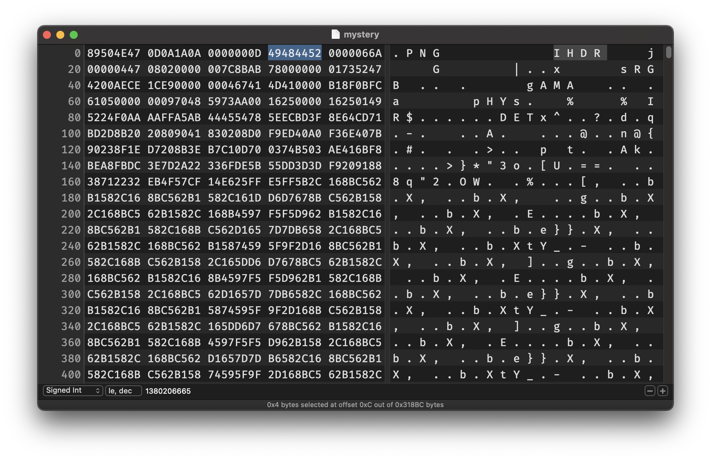
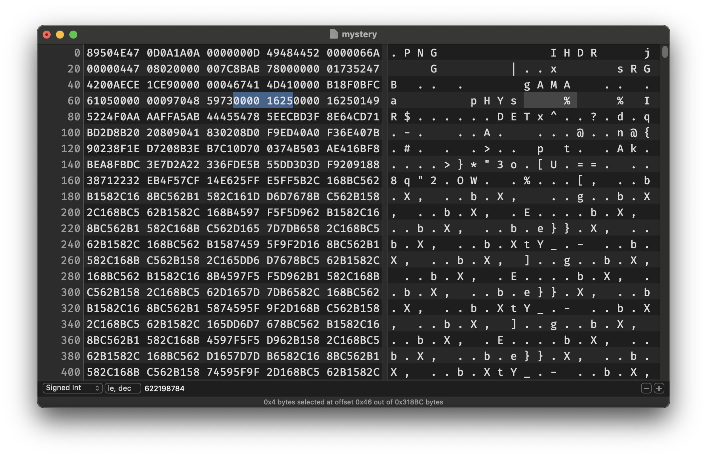
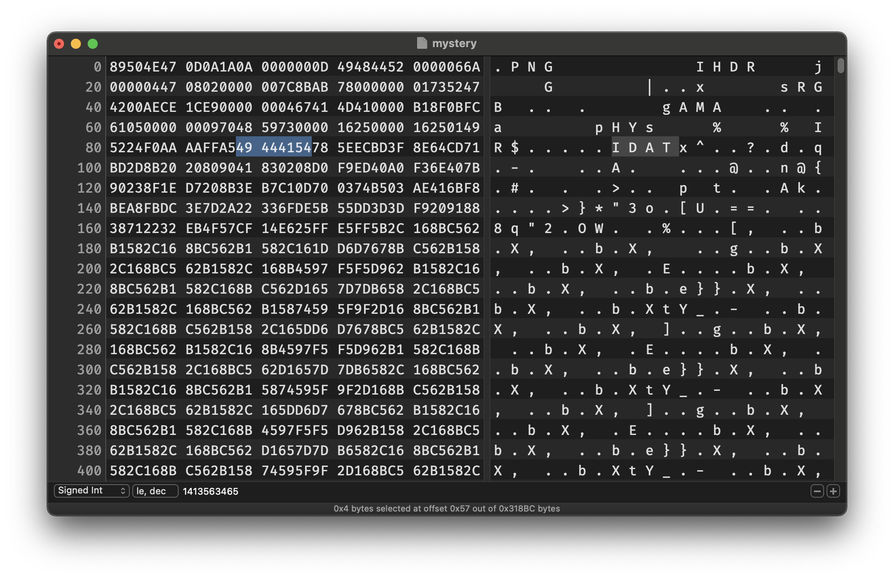
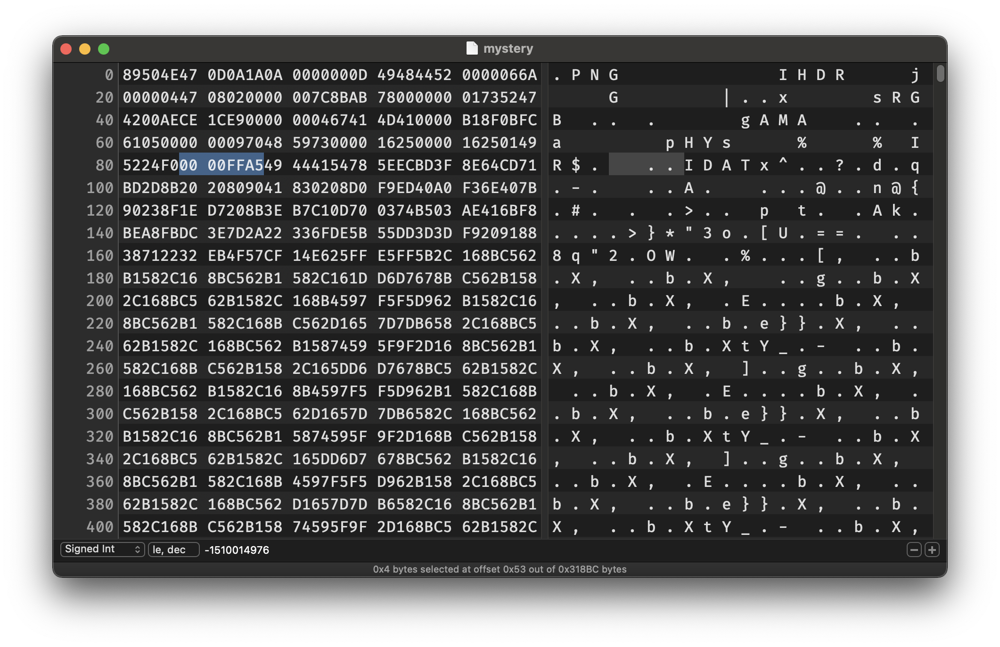
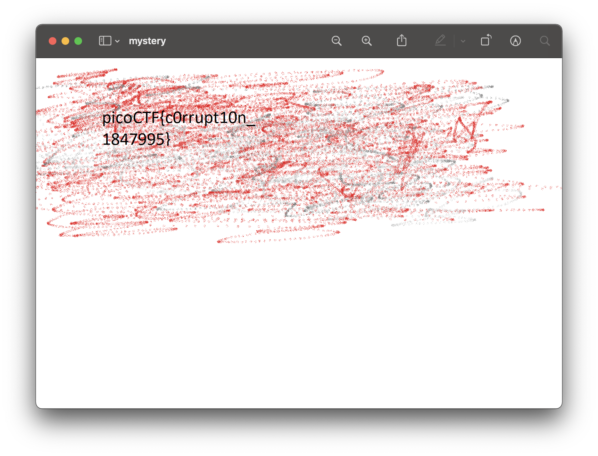

# c0rrupt
Points: 250

## Table of Contents
  * [Description](#description)
  * [Hints](#hints)
  * [Solution](#solution)
    * [**Tools**](#tools)
    * [**File header**](#file-header)
    * [**Invalid chunk name**](#invalid-chunk-name)
    * [**CRC code mismatch**](#crc-code-mismatch)
    * [**Invalid chunk length**](#invalid-chunk-length)
    * [**Fixed file**](#fixed-file)
  * [Flag](#flag)

## Description
We found this [file](files/mystery). Recover the flag.

## Hints
Try fixing the file header

## Solution

### **Tools**
Firstly, we can try to use the [```file```](https://linux.die.net/man/1/file) command to detect the file type. However, it does not return anything useful.

```
$ file mystery
mystery: data
```

Next, we can try to use a hex editor to analyse the file. In this case, I used [Hex Fiend](https://github.com/HexFiend/HexFiend) to solve this challenge. Alternatively, [ghex](https://wiki.gnome.org/Apps/Ghex) can also be used.



### **File header**
We can determine that the file is a PNG file. According to [this website](http://www.libpng.org/pub/png/spec/1.2/PNG-Contents.html), a PNG file contains several chunk types, such as sRGB, gAMA, pHYS (which we can see from the image above), IDAT, and IEND, and they can be found within this file.

```
$ xxd mystery | grep IDAT
00010000: 6927 db59 0000 fff4 4944 4154 3697 4678  i'.Y....IDAT6.Fx
00020000: ba6b c1fa 0000 fff4 4944 4154 d5df c0b7  .k......IDAT....
00030000: 5997 d200 0000 18a0 4944 4154 bb9d f54c  Y.......IDAT...L
```

```
$ xxd mystery | grep IEND
000318b0: 0000 0000 4945 4e44 ae42 6082            ....IEND.B`.
```

Therefore, we can try to change the file header from 
 
```89 65 4E 34 0D 0A B0 AA``` 

to

```89  50  4e  47  0d  0a  1a  0a```



Next, we can use [```pngcheck```](http://www.libpng.org/pub/png/apps/pngcheck.html) command line tool to help us check our progress.

First, save the modified file. Then, execute the following command.

```
$ pngcheck -v mystery
File: mystery (202940 bytes)
  invalid chunk name "C"DR" (43 22 44 52)
```

Prior to fixing the file header, ```pngcheck``` will not recognise the file as a PNG file. Now, it recognised the file perfectly. However, a new type of error is raised based on the output.

### **Invalid chunk name**
According to the output, there is an invalid chunk name ```C"DR```. We can assume that it should be the ```IHDR``` chunk, which is one of the critical chunks of a PNG file and it is located right after the file header.



```
$ pngcheck -v mystery
File: mystery (202940 bytes)
  chunk IHDR at offset 0x0000c, length 13
    1642 x 1095 image, 24-bit RGB, non-interlaced
  chunk sRGB at offset 0x00025, length 1
    rendering intent = perceptual
  chunk gAMA at offset 0x00032, length 4: 0.45455
  chunk pHYs at offset 0x00042, length 9: 2852132389x5669 pixels/meter
  CRC error in chunk pHYs (computed 38d82c82, expected 495224f0)
ERRORS DETECTED in mystery
```

Now, we managed to fix the ```IHDR``` chunk, but another error is raised.

### **CRC code mismatch**
According to the output, the computed CRC code does not match the code specified in the ```pHYs``` chunk.

In [this website](http://www.libpng.org/pub/png/spec/1.2/PNG-Structure.html#PNG-file-signature), it is specified that each chunk has four parts, which are:
* Length of the chunk (4 bytes)
  * E.g. the ```pHYs``` chunk length is ```00 00 00 09```
* Chunk Type (4 bytes)
  * E.g. the ```pHYs``` chunk type is ```70 48 59 73```
* Chunk Data
* CRC (4 bytes)
  * E.g. the ```pHYs``` CRC is ```49 52 24 F0```

Furthermore, in [this website's Table 11-4], the ```pHYs``` chunk data consists of:
* Pixels per unit, x axis (4 bytes)
  * In this case, ```AA 00 16 25```
* Pixels per unit, y axis (4 bytes)
  * In this case, ```00 00 16 25```
* Unit specifier (1 byte)
  * In this case, ```01```

The Pixels per unit, x axis seems to be the problem. In the ```pngcheck``` output, there are way too many pixels per meter (2852132389) on the x axis when compared to the y axis (5669). We can try to match pixels per unit on the x axis with the pixels per unit on the y axis.



```
$ pngcheck -v mystery
File: mystery (202940 bytes)
  chunk IHDR at offset 0x0000c, length 13
    1642 x 1095 image, 24-bit RGB, non-interlaced
  chunk sRGB at offset 0x00025, length 1
    rendering intent = perceptual
  chunk gAMA at offset 0x00032, length 4: 0.45455
  chunk pHYs at offset 0x00042, length 9: 5669x5669 pixels/meter (144 dpi)
:  invalid chunk length (too large)
ERRORS DETECTED in mystery
```

Now, let's fix the next error!

### **Invalid chunk length**
```pngcheck``` does not specify which chunk has the invalid length.
If we assume that ```pHYs``` is the final ancillary chunk in this PNG file, the next chunk is most likely to be the first ```IDAT``` chunk, which is another critical chunk that represents the image data.



According to [this website](http://www.libpng.org/pub/png/book/chapter08.html#png.ch08.div.4), each ```IDAT``` chunk can contain no more than 2 gigabytes of data. However, the size of this chunk, which is represented by the 4 bytes preceding the chunk type, shows ```AA AA FF A5``` or 2863333285, which is greater than 2 gigabytes.

Therefore, we need to count the actual size of the first ```IDAT``` chunk by getting the location of the next ```IDAT``` chunk and computing the distance between them. This can be done as multiple ```IDAT``` chunks need appear consecutively without any intervening chunk, according to [here](http://www.libpng.org/pub/png/spec/1.2/PNG-Chunks.html#C.pHYs).

```
$ xxd mystery | grep IDAT
00000050: 5224 f0aa aaff a549 4441 5478 5eec bd3f  R$.....IDATx^..?
00010000: 6927 db59 0000 fff4 4944 4154 3697 4678  i'.Y....IDAT6.Fx
00020000: ba6b c1fa 0000 fff4 4944 4154 d5df c0b7  .k......IDAT....
00030000: 5997 d200 0000 18a0 4944 4154 bb9d f54c  Y.......IDAT...L
```

We can see that the first ```IDAT``` is located at offset ```0x57``` and the second one is located at offset ```0x10008```. Thus, the distance is ```0xFFB1```.

However, we need to exclude the chunk type of the first ```IDAT``` chunk (4 bytes), the chunk type of the second ```IDAT``` chunk (4 bytes) and the length of the second ```IDAT``` chunk (4 bytes) as they should not be included in the calculation of the chunk length.
In total, we need to exclude ```0x4 + 0x4 + 0x4 = 0xC``` from ```0xFFB1```. The result is ```0xFFA5```.



```
$ pngcheck -v mystery
File: mystery (202940 bytes)
  chunk IHDR at offset 0x0000c, length 13
    1642 x 1095 image, 24-bit RGB, non-interlaced
  chunk sRGB at offset 0x00025, length 1
    rendering intent = perceptual
  chunk gAMA at offset 0x00032, length 4: 0.45455
  chunk pHYs at offset 0x00042, length 9: 5669x5669 pixels/meter (144 dpi)
  chunk IDAT at offset 0x00057, length 65445
    zlib: deflated, 32K window, fast compression
  chunk IDAT at offset 0x10008, length 65524
  chunk IDAT at offset 0x20008, length 65524
  chunk IDAT at offset 0x30008, length 6304
  chunk IEND at offset 0x318b4, length 0
No errors detected in mystery (9 chunks, 96.3% compression).
```

### **Fixed file**
Once we fixed the chunk length, there should be no more errors and we can view the PNG file to get the flag.



## Flag
picoCTF{c0rrupt10n_1847995}