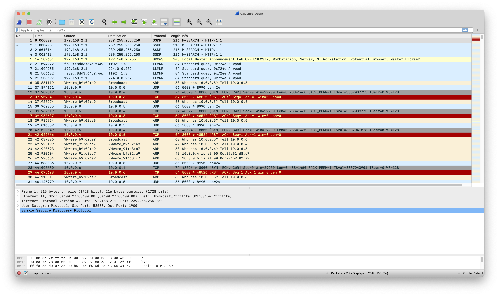
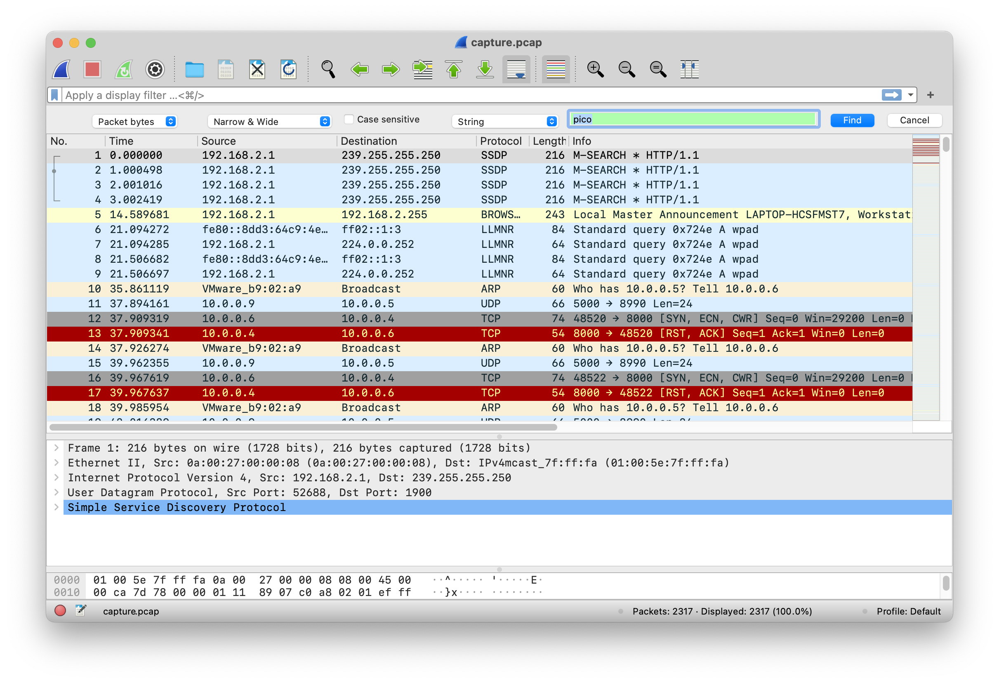
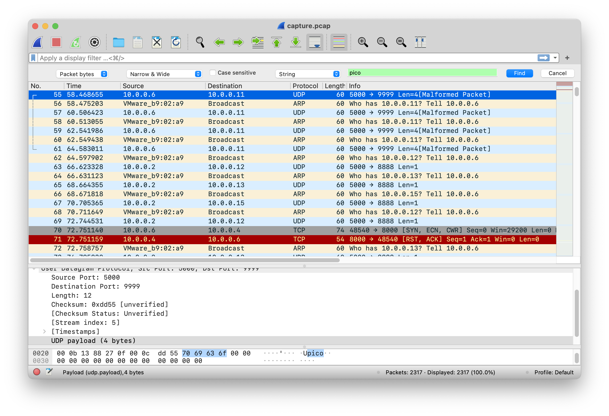
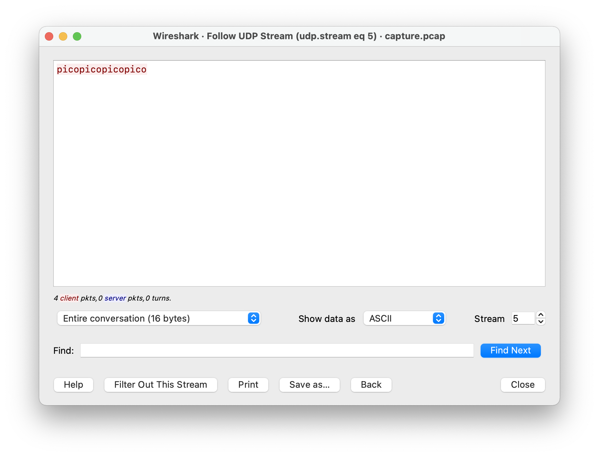
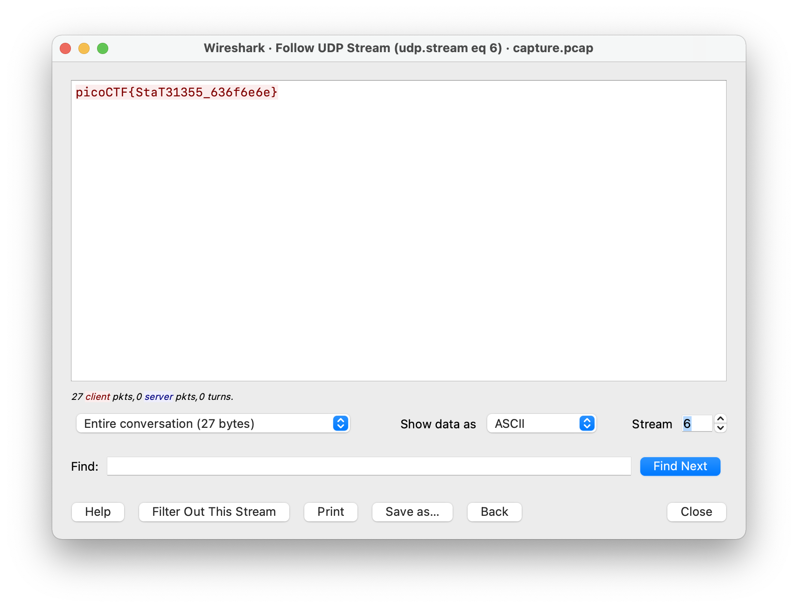
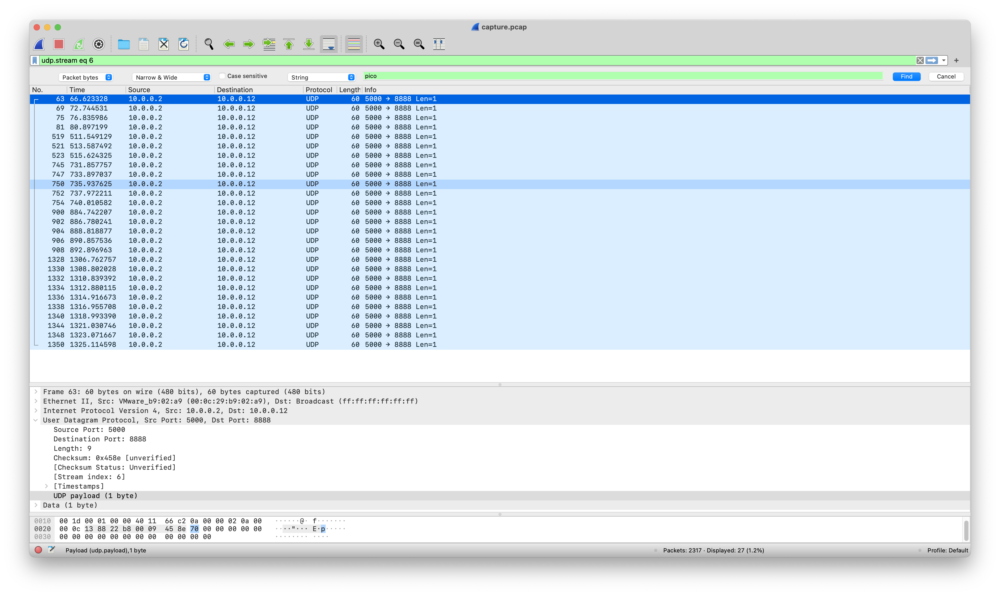

# shark on wire 1
Points: 150

## Table of Contents
  * [Description](#description)
    * [**Tools**](#tools)
    * [**Searching for a packet**](#searching-for-a-packet)
    * [**Following a stream**](#following-a-stream)
    * [**Note**](#note)
  * [Hints](#hints)
  * [Solution](#solution)
  * [Flag](#flag)

## Description
We found this [packet capture](files/capture.pcap). Recover the flag.

## Hints
1. <details><summary>Hint 1</summary>Try using a tool like Wireshark</details>
2. <details><summary>Hint 2</summary>What are streams?</details>

## Solution

### **Tools**
Firstly, we can use [Wireshark](https://www.wireshark.org/download.html) to open the pcap file.



### **Searching for a packet**
Next, we can try to find the packet that potentially contain the flag by clicking ```Edit > Find Packet...```. Then, set ```Display filter``` to ```String``` and change ```Packet list``` to ```Packet bytes```. In this case, we can search for the string ```pico``` and click ```Find```.



We can also search for the string ```picoCTF{```. In this case, however, there is no packet that contains the entire string. Instead, it is spread out into several packets. For example, one packet contains ```p```, the other contains ```i```, and so on.

Fortunately, there is a packet that contains the complete string ```pico```.



### **Following a stream**
The search result brings us to packet number 55. We can try to follow the stream by right clicking packet 55, select ```Follow > UDP Stream``` and another window will open.



It doesn't seem to contain the flag that we are looking for. What we can try to do next is to move to another stream by clicking the up arrow button next to ```Stream```.



The flag can be found in stream 6.

### **Note**
As mentioned previously, the complete flag is spread out into several packets in stream 6. 



In the screenshot above, each packet contains only 1 byte of data as shown by ```Len=1```. This means that packet 63 contains ```p```, packet 69 contains ```i``` and so on.

## Flag
<details>
<summary>Flag</summary>
picoCTF{StaT31355_636f6e6e}
</details>